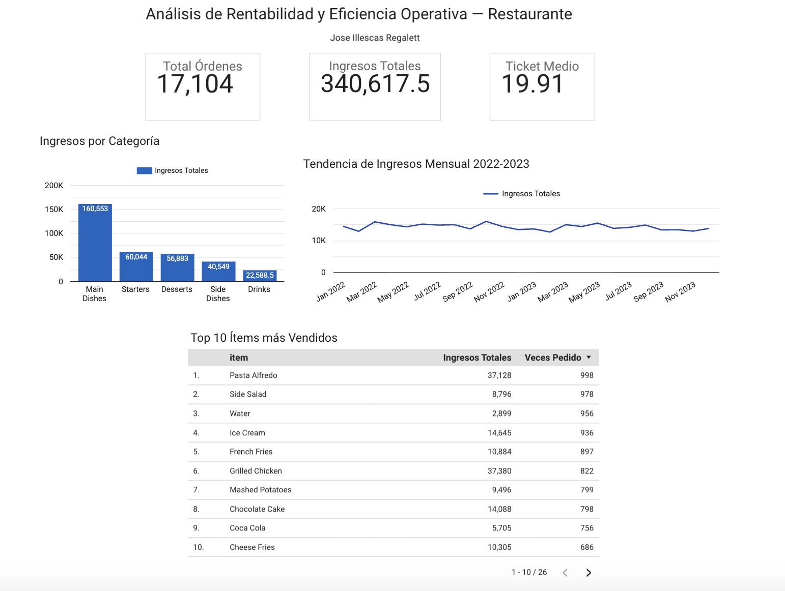

# 🍽️ Restaurant Operations Analytics | Análisis de Operaciones en Restauración

**Author / Autor:** Jose Illescas Regalett  
**Tools / Herramientas:** SQL · Google Sheets · Looker Studio  
**Dataset:** Restaurant Sales - Dirty Data (Kaggle)  
**Status / Estado:** Completed ✅

> *"Data without context is just noise. Seven years running restaurant operations across three countries gave me the context — this project gave it a structure."*
>
> *"Los datos sin contexto son ruido. Siete años operando restaurantes en tres países me dieron el contexto — este proyecto le dio estructura."*

---

## 🇬🇧 English

### Background

I hold a degree in Mechanical Engineering from Tecnológico de Monterrey in Mexico and a Food & Beverage Management certification from George Brown College in Toronto, Canada. I have spent seven years working in high-end hospitality in New York, Toronto, and Granada — managing inventory, training staff, and coordinating operations under pressure.

This project was built at the intersection of those two worlds: analytical thinking from engineering applied to problems I have lived firsthand in restaurant operations. I did not choose this industry to appear relatable. I chose it because I understand the decisions behind the data.

### Business Questions

1. Which menu categories drive the most revenue?
2. Which items are most ordered vs. most profitable — and are they the same?
3. What revenue trend exists between 2022 and 2023?
4. How are payment methods distributed, and what does that mean for daily cash management?
5. Which high-volume items generate low value and should be reconsidered?

### Analytical Process

**1. Data Quality Assessment**

Starting with 17,535 records, I identified and documented four distinct data quality issues before modifying a single row:

| Column | Issue | Treatment |
|---|---|---|
| item | 1,758 nulls + invisible empty strings | Selective cleaning by analysis context |
| price | 876 nulls | Imputation via order_total / quantity |
| quantity + order_total | 430 simultaneous nulls | Justified removal |
| payment_method | 1,082 invisible empty strings + "0" value | Reclassified as "No registrado" |

The distinction between NULL and empty string was critical here — SQL treats them differently, and a naive `IS NOT NULL` filter would have missed over 1,000 problematic records.

**2. Data Cleaning in SQL**

Rather than modifying the source data, I created a clean view `restaurant_clean` using CASE WHEN logic to handle each data quality issue specifically. This preserves the original dataset while enabling reliable analysis downstream.

Final clean dataset: **17,104 records**.

**3. Exploratory Analysis**

Five SQL queries addressing each business question, with documented reasoning behind every filter, aggregation, and join decision.

**4. Dashboard — Looker Studio**

Executive-level dashboard with three KPI scorecards, revenue by category bar chart, monthly trend line chart, and top 10 items table.

### Key Findings

- **Main Dishes** generates nearly 3x more revenue than the next category at similar order volume — the margin gap is structural, not accidental
- **Grilled Chicken** has the highest average ticket (45.47) with strong order frequency — an underleveraged asset in menu positioning and upselling
- **Water and Coca Cola** rank in the top 5 by order count but generate minimal revenue — classic high-volume, low-value items that occupy inventory, staff time, and menu real estate
- **2022 consistently outperformed 2023** across all months — a trend that warrants investigation in a real operational context
- **6% of transactions have no payment method recorded** — a data capture failure that creates reconciliation work at end-of-shift and masks true payment behavior

### What I Would Do With Real Data

This analysis was built on a public dataset. Applied to actual restaurant data, I would extend it to include ingredient-level demand forecasting to prevent stockouts, staff performance analysis by shift to identify peak service periods and align team composition with actual demand patterns, and real margin analysis incorporating supplier costs — the problems I observe daily in restaurant operations.

---

## 🇪🇸 Español

### Contexto

Soy ingeniero mecánico egresado del Tecnológico de Monterrey en México con certificación en Food & Beverage Management por George Brown College en Toronto, Canadá. Llevo siete años trabajando en hostelería de alto nivel en Nueva York, Toronto y Granada — gestionando inventarios, formando personal y coordinando operaciones bajo presión.

Este proyecto nació en la intersección de esos dos mundos: el razonamiento analítico de la ingeniería aplicado a problemas que he vivido de primera mano en operaciones de restaurante. No elegí este sector para resultar cercano. Lo elegí porque entiendo las decisiones que hay detrás de los datos.

### Preguntas de Negocio

1. ¿Qué categorías de carta generan más ingresos?
2. ¿Qué ítems se piden más versus cuáles son más rentables — y coinciden?
3. ¿Qué tendencia de ingresos existe entre 2022 y 2023?
4. ¿Cómo se distribuyen los métodos de pago y qué implica para la gestión de caja diaria?
5. ¿Qué ítems de alto volumen generan bajo valor y deberían revisarse?

### Proceso Analítico

**1. Diagnóstico de Calidad de Datos**

Partiendo de 17,535 registros, identifiqué y documenté cuatro tipos distintos de problemas de calidad antes de modificar una sola fila:

| Columna | Problema | Tratamiento |
|---|---|---|
| item | 1,758 nulos + strings vacíos invisibles | Limpieza selectiva por contexto de análisis |
| price | 876 nulos | Imputación: order_total / quantity |
| quantity + order_total | 430 nulos simultáneos | Eliminación justificada |
| payment_method | 1,082 strings vacíos invisibles + valor "0" | Reclasificados como "No registrado" |

La distinción entre NULL y string vacío fue crítica — SQL los trata de forma diferente, y un filtro `IS NOT NULL` simple habría ignorado más de 1,000 registros problemáticos.

**2. Limpieza y Transformación en SQL**

En lugar de modificar los datos originales, creé una vista limpia `restaurant_clean` usando lógica CASE WHEN para tratar cada problema de calidad de forma específica. Esto preserva el dataset original y garantiza análisis fiables aguas abajo.

Dataset limpio final: **17,104 registros**.

**3. Análisis Exploratorio**

Cinco consultas SQL que responden cada pregunta de negocio, con el razonamiento documentado detrás de cada filtro, agregación y decisión de diseño.

**4. Dashboard en Looker Studio**

Dashboard ejecutivo con tres KPIs principales, gráfico de barras de ingresos por categoría, gráfico de líneas de tendencia mensual y tabla de top 10 ítems.

### Hallazgos Principales

- **Main Dishes** genera casi 3 veces más ingresos que la siguiente categoría con un volumen de órdenes similar — la brecha de margen es estructural, no casual
- **Grilled Chicken** tiene el ticket medio más alto (45.47) con buena frecuencia de pedido — un activo infrautilizado en el posicionamiento de carta y la venta activa del equipo de sala
- **Water y Coca Cola** están en el top 5 por número de pedidos pero generan ingresos mínimos — ítems de alto volumen y bajo valor que ocupan inventario, tiempo de servicio y espacio en carta
- **2022 superó consistentemente a 2023** en todos los meses — una tendencia que en un contexto operativo real requeriría investigación inmediata
- **El 6% de transacciones no tiene método de pago registrado** — un fallo de captura de datos que genera trabajo extra al cierre de caja y distorsiona el análisis de comportamiento de pago

### Qué haría con datos reales

Este análisis se construyó sobre un dataset público. Aplicado a datos reales de un restaurante, lo extendería para incluir previsión de demanda por ingrediente para evitar roturas de stock, análisis de rendimiento por turno para identificar los picos de servicio reales y alinear la composición del equipo con los patrones de demanda, y análisis de margen real incorporando costes de proveedor — los problemas que observo a diario en operaciones de restaurante.

---

## Dashboard

https://datastudio.google.com/reporting/e4528ba8-9c0e-4f2e-9c28-9d70980e45f5/page/RPAyF



---

## Estructura del Repositorio / Repository Structure

```
├── README.md
├── dashboard_preview.png
├── restaurant_clean.csv
└── sql/
    └── queries.sql
```
